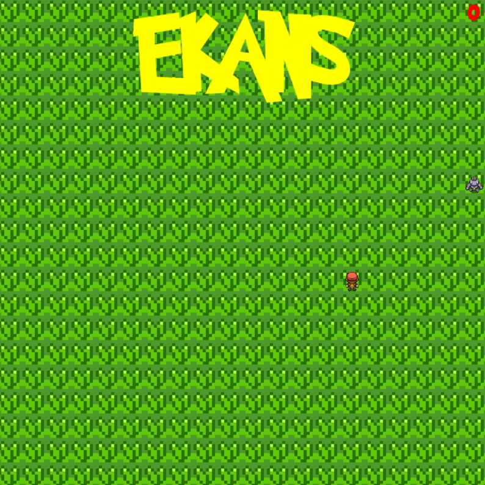
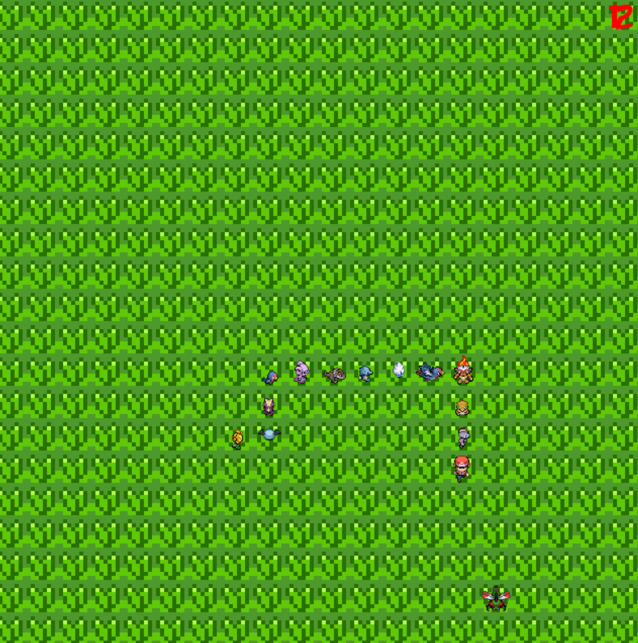
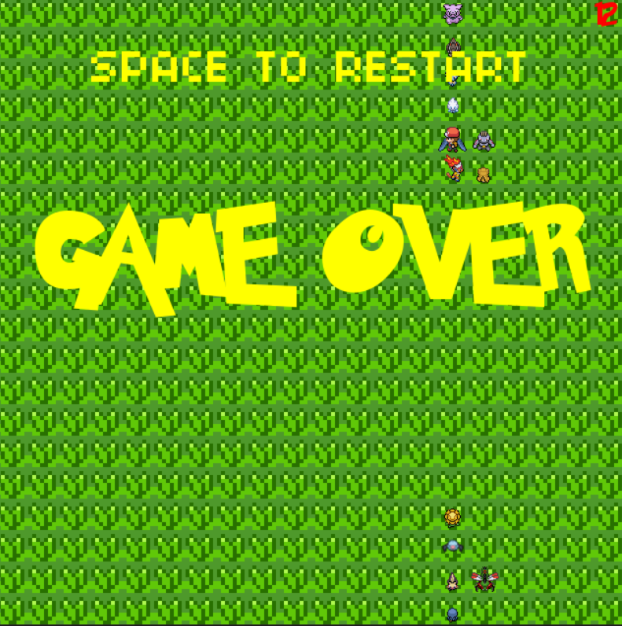

# Ekans
> Snake inspired game with Pokemon textures.

## Table of contents
* [General info](#general-info)
* [Screenshots](#screenshots)
* [Technologies](#technologies)
* [Setup](#setup)
* [Features](#features)
* [Status](#status)
* [Inspiration](#inspiration)
* [Contact](#contact)

## General info
Final project for CS50x course. Made with Lua and Love2D, a framework to make 2D games.

## Screenshots

## Controls
* Movements with left, right, up, down
* Space to restart when game is over
* Escape to exit

## Contact
Created by Immanuel Huang - feel free to contact me at [@immanuelgyhuang@gmail.com](immanuelgyhuang@gmail.com)!